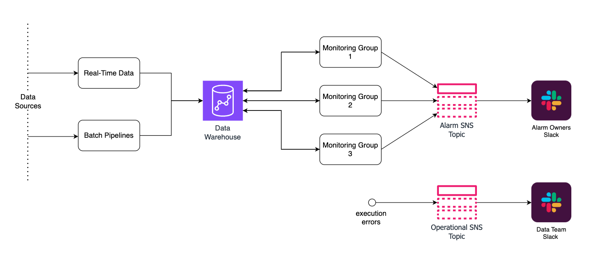
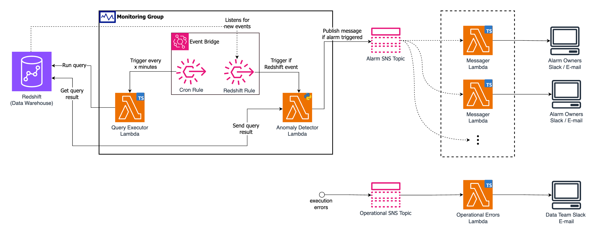

# Heimdall

## Project Overview

---

Heimdall is a sophisticated alarm service integrating AWS and machine learning to scrutinize operational metrics within an Amazon Redshift cluster. It leverages the AWS CDK to deploy a network of microservices, each equipped with time series analysis for real-time anomaly detection and threshold monitoring, ensuring continuous data integrity and system performance.

## Introduction

---

It is essential to monitor our operation, or in other words, to monitor the data our operation produces. That could be the amount of Pix transactions, the number of cards requested, or the amount of new users. New data is being collected and stored in our databases all the time. Because of this, in order to properly monitor the data, we need to periodically fetch it and analyze it. 

Since our data is stored in a AWS Redshift cluster, we will be doing SQL queries to the cluster in order to fetch data. Each query we define could return a series of informations at once, for example: number of approved transactions, number of rejected transactions, and total amount of approved transacted value (TTV) by hour. We then would want to run analysis over this information, and we could have separate analysis for each column, and search for anomalies in each of those analysis. 

Given the motivation and this line of thought, we came up with two abstractions that can help us encapsulate the problem: Monitoring Groups and Alarms.

## Alarms

---

An alarm is a essentially an abstraction comprised of several functions that operate based on some configuration. It receives some data, runs it through a model that detects anomalous data points and triggers if there are enough anomalies.

The core of each alarm resides in the Anomaly Detector Lambda, written in Python, and we chose that language because of its powerful data processing capabilities.

For better understanding, we could break what the alarm does into two functions:

- The first function receives data that comes from our databases, such as TTV by hour, which model it will use to detect anomalies, the parameters for that model and the column(s) of the data it will use for the analysis. This function is responsible for flagging each data point as being anomalous or not.
- The second one will receive the output of the first one, which will be the same data but with the added information (an extra column called `is_anomaly`) of whether each data point is anomalous or not. Also, it receives some parameters such as how many anomalies are allowed. If for example, the number of anomalies is greater that the maximum allowed anomalies, then it will indicate that the data is anomalous, which means that the alarm is triggered.

## Monitoring Groups

---

A Monitoring Group is essentially defined by a SQL query, the collection of alarms that will monitor the data returned by that query and with which frequency the query is executed. What that means is, a SQL query will be defined for each monitoring group, that query is executed against our Data Warehouse, which returns some data, and the alarms will be responsible for running intelligent models over that data to decide whether it is anomalous or not.

As you can see, monitoring groups encapsulate groups of alarms that operate over similar data, that is, coming from the same query. They are also divided into some types, such as Time Series, which means that the data queried is time-based.

# Architecture

---

## Overview

---

Heimdall’s architecture leverages the AWS Cloud Development Kit (CDK) with TypeScript, allowing for a declarative approach to infrastructure as code. This design methodology enables rapid deployment, version control, and collaboration for infrastructure setup, providing a transparent and reproducible environment that aligns with modern DevOps practices.

The design emphasizes a microservice architecture, ensuring each alarm can operate independently, scaled, and managed without affecting others. This approach offers high availability and resilience, as it minimizes the risk of cascading failures and allows for targeted scaling and updates.

Heimdall leverages 4 AWS services for its operation:

- **Amazon Redshift:** A managed data warehouse used for storing operational data and performing complex analysis.
- **AWS Lambda:** Executes Redshift queries, analyzes results for anomalies via machine learning, and sends alerts when issues are detected.
- **Amazon EventBridge:** Orchestrates event-driven workflows, triggering Lambdas on query completion.
- **AWS Simple Notification Service (SNS):** Manages the distribution of alarm notifications across various channels.

Here is a general overview of the solution architecture:

Heimdall architecture overview

Data is stored in our Data Warehouse (Redshift) coming from various sources, that could be real-time or coming from batch pipelines. Using this data, we configure and set up various Monitoring Groups that will run periodically over the data and fire alarms if that data is considered anomalous. Simultaneously, if any operational errors arise, that will be caught and sent to the Data team for further analysis.

We will dive deeper into the core components and how they interact with each other in the next section.

## Core Components & Workflow

---

### Core Components

These are Heimdall core components and their roles:

- **Amazon Redshift:** Amazon Redshift serves as the central repository for our operational data, providing robust storage capabilities and optimized query performance. This is where we will execute our queries from.
- **AWS Lambda:**
    - **Query Executor Lambda**: This AWS Lambda function is responsible for executing queries against the Amazon Redshift data warehouse. It is triggered by scheduled event (EventBridge) and runs SQL statement in Redshift with the respective alarm data.
    - **Anomaly Detector Lambda**: After the Query Executor Lambda has finished running the necessary SQL statements, this Lambda function takes over to analyze the results. Its role is to apply machine learning models to detect anomalies or patterns within the data that might indicate issues or opportunities for further investigation, and trigger the alarm in case data is considered anomalous.
    - **Messenger Lambda**: This function is activated if the Anomaly Detector Lambda identifies any data points that warrant attention. It handles the creation and sending of notifications to specified channels, such as a Slack workspace, alerting team members to the detected anomalies. This enables quick response and resolution to potential issues.
- **Amazon EventBridge:** This serverless event bus enables the orchestration of automated workflows by connecting applications with data from a variety of sources. Amazon EventBridge facilitates the scheduling of custom alarm actions and the establishment of event-driven rules that can trigger responses, such as the execution of AWS Lambda functions, upon the successful completion of queries in Amazon Redshift.
- **AWS Simple Notification Service (SNS):** AWS SNS acts as a fully managed messaging service for both application-to-application (A2A) and application-to-person (A2P) communication. It's utilized within this architecture to disseminate alarms and alerts efficiently. Upon detection of specified conditions or anomalies, AWS SNS can broadcast notifications to subscribed endpoints or channels, such as email, SMS, or third-party services like Slack, ensuring immediate awareness and prompt response to critical events.

### Workflow

The diagram below is a more detailed view of the architecture, revealing the underlying components/services that are used. You can zoom in and drag around for better visualization.

